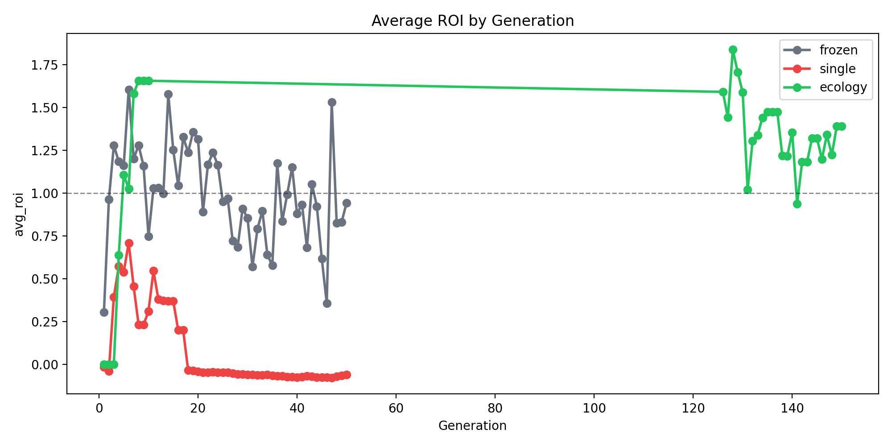

# Evolora — Symbiotic LLM Ecology
[](https://deepwiki.com/strangeloopcanon/evolora)

**What if we started *evolving* language models?**

Evolora treats a small LLM as a computational substrate—like the "physics" of a world—and evolves a population of tiny LoRA adapters ("organelles") that compete, learn, merge, and die based on their performance. It's artificial life meets language models: adapters pay energy to attempt tasks, earn rewards when they succeed, go bankrupt when they fail, and occasionally merge into new offspring when they prove their worth.

---

## Core Idea

```
┌─────────────────────────────────────────────────────────────────┐
│                     FROZEN HOST (Qwen3-0.6B)                    │
│                    (weights never change)                       │
├─────────────────────────────────────────────────────────────────┤
│  ┌──────────┐  ┌──────────┐  ┌──────────┐       ┌──────────┐   │
│  │Organelle │  │Organelle │  │Organelle │  ...  │Organelle │   │
│  │  (LoRA)  │  │  (LoRA)  │  │  (LoRA)  │       │  (LoRA)  │   │
│  └────┬─────┘  └────┬─────┘  └────┬─────┘       └────┬─────┘   │
│       │             │             │                  │         │
│       └─────────────┴──────┬──────┴──────────────────┘         │
│                            ▼                                    │
│              ┌─────────────────────────┐                       │
│              │    ENERGY ECONOMY       │                       │
│              │  • Pay to participate   │                       │
│              │  • Earn via rewards     │                       │
│              │  • Bankrupt → retire    │                       │
│              │  • Merge on uplift      │                       │
│              └─────────────────────────┘                       │
└─────────────────────────────────────────────────────────────────┘
```

Three things are being optimised simultaneously:
1. **Per-call competence** — each organelle tries to maximise reward on tasks
2. **Energy efficiency** — ROI = reward − cost; cheap *and* good wins
3. **Population diversity** — a quality-diversity archive nudges the ecology toward covering different niches

### Three Levels of Learning

1. **Local plasticity** — reward-modulated local updates within each organelle (Hebbian or backprop; per episode)
2. **Population selection** — assimilation + merging of successful adapters (per generation)
3. **Meta-evolution** — tuning ecology parameters (assimilation threshold, energy floor, etc.)

---

## Key Results (Qwen3-0.6B, 150 generations)

| Condition | Episodes | Mean ROI | Merges | QD Coverage | Holdout Acc | Holdout Cost |
|-----------|----------|----------|--------|-------------|-------------|--------------|
| Frozen base | 1,727 | 0.94 | 0 | 0% | 13.3% | 1.91 |
| Single adapter | 63 | −0.06 | 0 | 0% | 13.3% | 1.94 |
| **Full ecology** | 7,413 | **1.39** | 52 | 16.7% | **14.2%** | **1.14** |



The ecology achieves **higher ROI**, **better holdout accuracy**, and **40% lower inference cost** compared to baselines—while the frozen host and single-adapter setups remain structurally inert.

See `docs/paper_packs/` for detailed run reports and plots.

---

## Key Finding: Specialization vs Robustness

So far, the pattern looks like this:

These robustness numbers come from a historical broad-mix run on `Qwen/Qwen2.5-0.5B` (kept for comparison with the Qwen3 table above).

- **SFT wins on specialization**: on in-distribution tasks, compute-matched SFT (matched on training FLOPs) is usually the strongest baseline.
- **Evolution can win on robustness**: on a family shift, a routed portfolio of evolved specialists can beat SFT—sometimes by retaining a capability that a single adapter loses (e.g., `word.count`).

- **ID (6-family grid mix; Qwen/Qwen2.5-0.5B)**: base **70/512 (13.7%)**, SFT **318/512 (62.1%)**, evo (routed) **157/512 (30.7%)**
- **OOD (paper holdout; math + word.count + code.format; Qwen/Qwen2.5-0.5B)**: base **5/120 (4.2%)**, SFT **54/120 (45.0%)**, evo (routed) **68/120 (56.7%)**
  - Best single evolved organelle: **58/120 (48.3%)**; routing + OOD reselection: **68/120 (56.7%)**
  - Most striking detail: SFT collapsed on `word.count` (**1/40**) while evo stayed closer to base (**7/40**).

<details>
<summary>Reproduce the OOD comparison (uses an existing run directory)</summary>

```bash
# Example: evaluate an existing grid run on the paper holdout (OOD family shift).
# IMPORTANT: selection tasks must be different from the holdout to avoid leakage.
# Note: this particular holdout includes two families not present in the 6-family training mix (`math`, `word.count`)
# plus one overlapping family (`code.format`) with a shifted distribution.
#
# Fairness note: "routed + reselection" uses a small selection set to pick specialists (extra eval-time compute).
# If you want a strict single-pass comparison, use a single selected organelle (`--evo-eval-routing single`)
# or reuse an existing routing map.

python scripts/generate_grid_datasets.py \
  --config config/experiments/paper_qwen3_ecology.yaml \
  --seed 4242 \
  --train-size 1000 \
  --selection-size 192 \
  --holdout-size 192 \
  --out-dir artifacts_ood_eval_paper/datasets

python scripts/evaluate_holdout.py \
  --holdout config/evaluation/paper_qwen3_holdout_v1.jsonl \
  --model <BASE_MODEL_MATCHING_RUN> \
  --sft-adapter <RUN_DIR>/sft/peft_adapter \
  --evo-checkpoint <RUN_DIR>/checkpoint.pt \
  --evo-eval-routing family \
  --evo-selection-tasks artifacts_ood_eval_paper/datasets/selection_tasks.jsonl \
  --evo-selection-max-samples 64 \
  --evo-selection-max-new-tokens 64 \
  --output artifacts_ood_eval_paper/eval_paper_holdout.json
```

</details>

---

## Comparing Evolution vs SFT (Compute-Matched)

A key question: does evolutionary adaptation actually outperform standard supervised fine-tuning given the same compute budget? This section explains how to run a fair comparison.

Note: `scripts/run_sft.py` depends on `datasets` (in `requirements.txt`). If you see `ModuleNotFoundError: No module named 'datasets'`, run `make setup` (or `.venv/bin/python -m pip install -r requirements.txt`).

### What We Found (Regex Generalization Snapshot)

In a historical compute-matched run on **Qwen/Qwen2.5-0.5B** (LoRA rank=7; evo organelles trained with `EVOLORA_PLASTICITY=backprop`):

- **OOD holdout** (`config/evaluation/regex_generalization.jsonl`, 19 tasks): base **2/19** (10.5%), SFT **12/19** (63.2%), evo **5/19** (26.3%)
- **ID holdout** (512 generated tasks from the same task mix): base **94/512** (18.4%), SFT **354/512** (69.1%), evo **148/512** (28.9%)

Interpretation:
- **Signal density matters:** under a fixed *training compute* budget, SFT (gold targets + dense token-level gradients) is far more sample-efficient than evo (rollouts + sparse scalar rewards).
- **Evo > base, but ≪ SFT:** the best evolved organelle reliably improves over base, but remains well behind compute-matched SFT in this setting.
- **No-op adapter pitfall:** mixed populations can include adapters with effectively zero LoRA weights; `evaluate_holdout.py` skips these when any non-zero adapters exist.

See `docs/regex_generalization.md` for the task mix, evaluation details, and additional context.

### Quick E2E Example

```bash
# End-to-end runner (calibration → resume → compute-matched SFT → eval).
# Generates distribution-matched regex datasets into <run_dir>/datasets/.
make regex-evo-vs-sft REGEX_FULL_GENS=10 REGEX_CALIB_GENS=2 REGEX_CHECKPOINT_EVERY=1
```

### How It Works

1. **Run evolution** with compute tracking enabled:
   - `ComputeBudget` tracks total tokens, forward passes, and Hebbian updates
   - Metrics saved to checkpoint and `gen_summaries.jsonl`

2. **Run SFT with matched budget**:
   ```bash
   # Recommended: match evo "training" compute via FLOPs (more stable than tokens)
   python scripts/run_sft.py \
       --checkpoint artifacts_evo/checkpoint.pt \
       --match-budget-field train_flops \
       --backprop-multiplier 3.0 \
       --attn-implementation eager \
       --engine manual \
       --resume \
       --data artifacts_evo/datasets/sft_train.jsonl \
       --output artifacts_sft

   # Alternatives: wall-clock match or an explicit token budget
   python scripts/run_sft.py \
       --match-budget-field wall_clock_seconds \
       --attn-implementation eager \
       --engine manual \
       --resume \
       --data artifacts_evo/datasets/sft_train.jsonl \
       --output artifacts_sft

   python scripts/run_sft.py \
       --token-budget 500000 \
       --data artifacts_evo/datasets/sft_train.jsonl \
       --output artifacts_sft
   ```
   - On macOS/MPS, the default engine uses a manual training loop with NaN guards and resumable checkpoints
   - Exports LoRA compatible with `HostKernel.load_organelle_adapter()`

3. **Evaluate both** on the same holdout tasks:
   ```bash
   # In-distribution regex holdout (and selection set for evo organelle picking)
   python scripts/evaluate_holdout.py \
       --holdout artifacts_evo/datasets/holdout_tasks.jsonl \
       --evo-selection-tasks artifacts_evo/datasets/selection_tasks.jsonl \
       --sft-adapter artifacts_sft/peft_adapter \
       --evo-checkpoint artifacts_evo/checkpoint.pt \
       --output comparison_results_id.json

   # OOD / mixed holdout (optional)
   python scripts/evaluate_holdout.py \
       --holdout config/evaluation/regex_generalization.jsonl \
       --evo-selection-tasks artifacts_evo/datasets/selection_tasks.jsonl \
       --sft-adapter artifacts_sft/peft_adapter \
       --evo-checkpoint artifacts_evo/checkpoint.pt \
       --output comparison_results_ood.json
   ```
   - Compares base model, SFT, and best evolution organelle
   - Picks the best evolved organelle on `--evo-selection-tasks` (to avoid test leakage)

### Key Scripts

| Script | Purpose |
|--------|---------|
| `scripts/run_evolution.py` | Run evolutionary LoRA with compute tracking |
| `scripts/run_sft.py` | Train SFT baseline with matched token budget |
| `scripts/evaluate_holdout.py` | Compare models on holdout tasks |

### Important Notes

- **Model compatibility**: The evolution checkpoint and evaluation must use the same base model (check tensor shapes match)
- **Token tracking**: Tokens are tracked in `observations.metrics.tokens` in episodes.jsonl
- **Best organelle selection**: `evaluate_holdout.py` selects the best organelle by scoring candidates on a separate selection/validation set (configurable via `--evo-selection-tasks`), with ROI-based fallback. If any adapters have non-zero LoRA weights, selection ignores no-op (zero-magnitude) adapters to avoid picking a “base-like” organelle.

This enables fair comparison: evolutionary adaptation (many small adapters + population dynamics) vs traditional gradient-based fine-tuning (single adapter, supervised loss).

---

## Project Structure

```
src/symbiont_ecology/
├── host/           # Frozen backbone wrapper, LoRA slot management
├── organelles/     # Hebbian-PEFT adapters with eligibility traces
├── routing/        # Bandit router for adapter selection
├── evolution/      # Population manager, model merger, morphogenesis
├── environment/    # Task factory, ecology loop, grid controller
├── economics/      # ATP ledger, energy settlement
├── metrics/        # Telemetry sink, QD archive, ComputeBudget tracking
└── config.py       # Pydantic config models

config/
├── experiments/    # YAML configs: frozen, single, ecology variants
├── evaluation/     # Holdout task sets (e.g., regex_generalization.jsonl)
├── training/       # SFT training data (e.g., regex_sft_data.jsonl)
└── ecology.yaml    # Base ecology parameters

scripts/
├── run_evolution.py        # Main experiment runner (resumable)
├── run_sft.py              # SFT baseline trainer (compute-matched)
├── evaluate_holdout.py     # Compare models on holdout tasks
├── analyze_ecology_run.py  # Generate reports + plots from a run
├── evoscope.py             # Interactive run visualisation
├── paper_pack.py           # Bundle runs into tracked summaries
└── benchmark_suite.py      # CI-safe benchmark harness
```

---

## What you get
- YAML-configured experiments under `config/experiments/`
- CI-safe benchmark harness (stubbed backend; no model downloads)
- Run artifacts under `artifacts_*` (telemetry + plots)
- Analysis + visualization: `scripts/analyze_ecology_run.py`, `scripts/evoscope.py`
- Paper packs (tracked summaries): `docs/paper_packs/`

## Quickstart (CI-safe)
```bash
make all
AGENT_MODE=baseline .venv/bin/python scripts/benchmark_suite.py --mode ci
```

## Reproduce the paper-style Qwen3 suite
```bash
scripts/run_paper_ecology_suite.sh all
```

Optional: add a fixed, measurement-only holdout suite (paper packs will include holdout metrics):
```bash
FINAL_HOLDOUT_TASKS=config/evaluation/paper_qwen3_holdout_v1.jsonl \
FINAL_HOLDOUT_SAMPLE_SIZE=120 \
scripts/run_paper_ecology_suite.sh all
```

For long runs, a good workflow is “calibrate → resume”: run ~10 generations to validate the config/model load, then resume the same run directory to the full length via `--resume-from`:
```bash
make calibrate-resume CONFIG=config/experiments/paper_qwen3_ecology.yaml FULL_GENS=50
```

## Analyze a run
```bash
MPLCONFIGDIR="$(mktemp -d)" .venv/bin/python scripts/analyze_ecology_run.py <run_dir> --plots --report
MPLCONFIGDIR="$(mktemp -d)" .venv/bin/python scripts/evoscope.py <run_dir>
```

## Docs
- `docs/running.md` — how to run longer experiments (resume/holdout)
- `docs/ecology_overview.md` — conceptual overview + baselines framing
- `docs/architecture.md` — module-level architecture sketch
- `docs/paper_packs/README.md` — paper packs (tables + plots) + examples

## Notes
- Full experiments download model weights from Hugging Face; use the CI benchmark mode above for a fast smoke test without downloads.
- On macOS, `MPLCONFIGDIR="$(mktemp -d)"` avoids matplotlib font-cache issues in long runs/plots.
