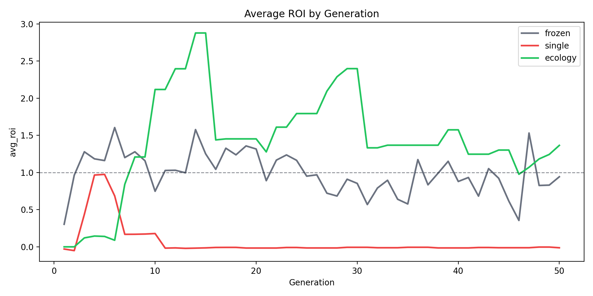
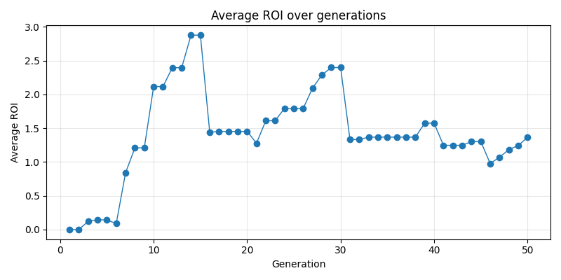

# Paper Candidate Pack — Qwen3-0.6B (2025-12-15)

- git_commit: `7df1278`
- source_runs:
  - frozen: `artifacts_paper_qwen3_frozen_20251215_094901`
  - single: `artifacts_paper_qwen3_single_20251215_162455`
  - ecology: `artifacts_paper_qwen3_ecology_20251215_162621`

## Summary Table

| condition | gens | episodes | avg_roi (mean) | merges_total | colonies_max | qd_cov_max |
| --- | ---: | ---: | ---: | ---: | ---: | ---: |
| frozen | 50 | 1727 | 0.996 | 0 | 0 | 0.0% |
| single | 50 | 25 | 0.064 | 0 | 0 | 0.0% |
| ecology | 50 | 2058 | 1.421 | 20 | 1 | 20.8% |

## ROI Comparison

## Ecology Highlights

### Ecology ROI

### Ecology merges

### Ecology colonies

### Ecology QD coverage

## Included Files

- `reports/`: copied `report.md` from each run
- `plots/`: curated plots copied from each run + an aggregate comparison plot
- `summary.json`: machine-readable summary extracted from `gen_summaries.jsonl`
